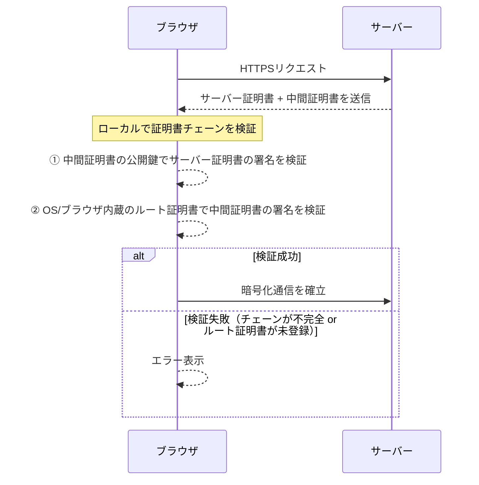
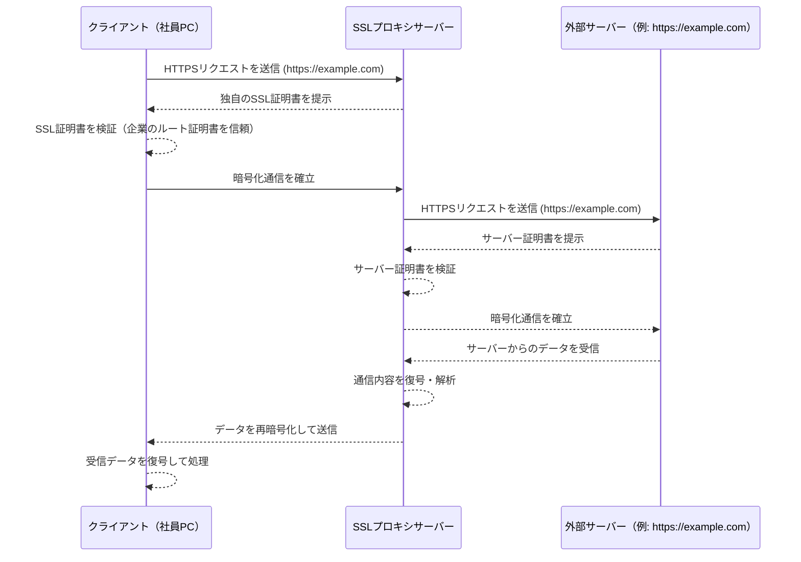

SSL証明書、中間証明書、オレオレ証明書など開発中によく出くわす証明書関連の概念について、いつもわからなって都度調べている状態なので、、、整理のためにブログにまとめます。

# 証明書とは
あるサーバーが認証局から信頼された存在であることを証明するもの。クライアントからサーバーに接続する際、相手のサーバーが悪意のあるサイトやフィッシングサイトではないことを保証します。

### 例え話
海外旅行などで他国に入国する時、パスポートを使いますよね。
- 入国者・・・サーバー
- 空港・・・クライアント
- パスポート・・・証明書

で置き換えて考えてください。

羽田空港に到着した外国人は空港の入国審査で自身のパスポートを提示します。パスポートは各国の政府機関が発行したものでその人の身分・国籍を証明する公的書類です。空港は入国者一人一人にパスポートの提示を要求し、身分を正しく証明できる人だけを入国させます。

ネットワークの世界でも同様で、クライアント（ブラウザなど）がサーバーにアクセスする際にサーバー側に存在する証明書を確認し、そのサーバーが信頼されたサイトであることを確認してからアクセスを許可します。

# 証明書の種類
証明書にも種類があります。

### SSL証明書
サーバーが怪しくないことを証明する証明書です。サーバーの数だけSSL証明書が存在します。中間証明書/ルート証明書に身元を保証されています。

HTTPS通信ではTLS/SSLを利用するのでSSL証明書と呼ばれることが多いです。ネットワークの文脈で「証明書」というとSSL証明書のことを指していると思っていいです。実際にはSSLはもう枯れた技術でほとんど利用されておらずTLSが主流になっていますが、SSLが主流の頃にSSL証明書という言葉がIT業界内で浸透したので令和になった今も慣習的にSSL証明書と呼ぶことが多いです。

### 中間証明書・ルート証明書
証明書を発行する機関を認証局といいます。英語ではCertificate Authorityと呼ぶのでよくCAと略されます。CAには中間CAとルートCAがあり、それぞれが発行した証明書を中間証明書・ルート証明書と呼びます。

技術的にはルート証明書さえあればクライアントとサーバーの通信は可能です。しかし、中間証明書が存在することで以下のメリットが享受可能になります。

- **リスク分散**: 中間証明書が期限切れや漏洩などによって一時的に利用できなくなった場合でもすぐに別の中間証明書を発行することで被害を最小限に抑えることができる
- **ルート証明書の保護**: ルート証明書への攻撃や負荷を軽減できる

### オレオレ証明書
認証局を通さず、個人のローカル環境で作成しただけの非公式な証明書のことを指します。（証明書自体はCLIから誰でも作成が可能）
オレオレ証明書は主に検証環境などで一時的に利用する用途で発行されることがほとんどで、HTTPS通信を実現したいが認証局で公式に発行するのは手間な時に利用されます。本番環境での利用はNGです。

# SSL代理証明
- 企業ネットワークなどで、社員の通信を監視したいニーズが有る。しかしクライアント（社員）とサーバーの通信はSSLで暗号化されているため監視できない。
- クライアントとサーバーの間にプロキシサーバーを割り込ませる
- プロキシサーバーとサーバー間では通常通りのSSL通信を行う
- 企業用の独自のSSL証明書を発行し、クライアントとプロキシ間では独自SSL証明書を使った通信をさせる。クライアントにはあらかじめ独自SSL証明書を配布しインストールさせておく。

