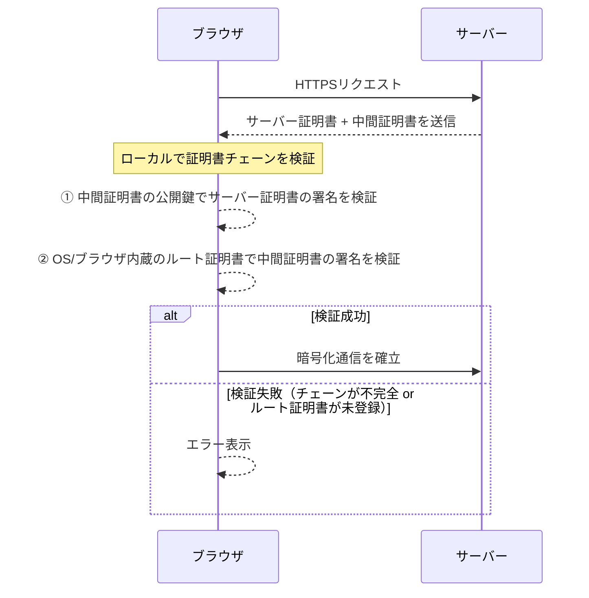
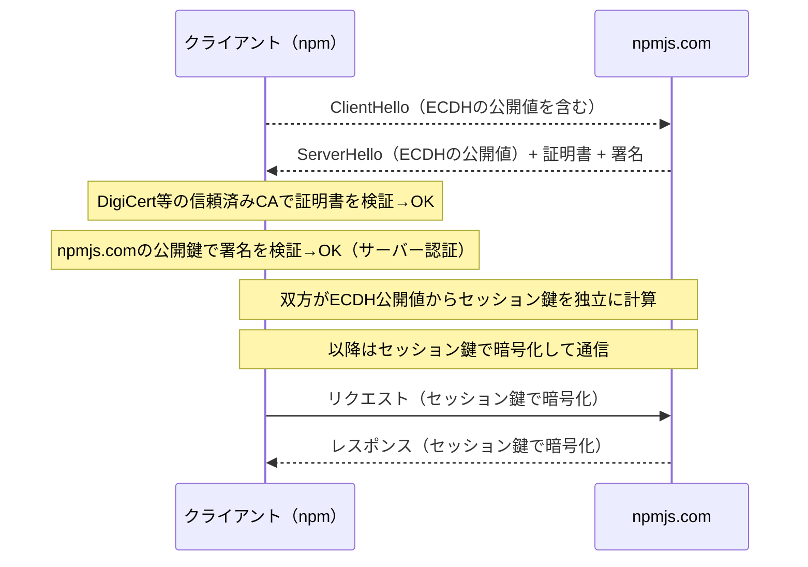
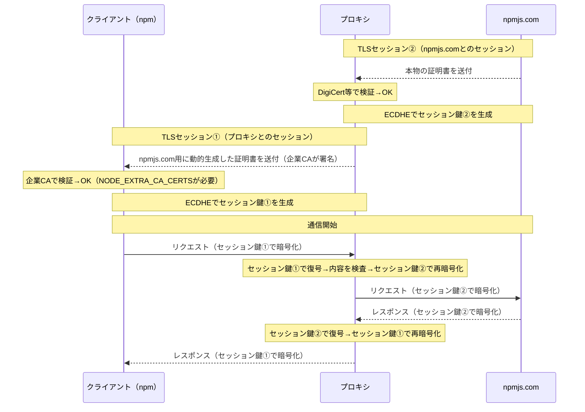

SSL証明書、中間証明書、オレオレ証明書など開発中によく出くわす証明書関連の概念について、いつもわからなくって都度調べている状態なので、、、整理のためにブログにまとめます。

- [証明書とは](#証明書とは)
  - [例え話](#例え話)
- [証明書の種類](#証明書の種類)
  - [SSL証明書](#ssl証明書)
  - [中間証明書・ルート証明書](#中間証明書ルート証明書)
  - [オレオレ証明書](#オレオレ証明書)
- [SSLインスペクション（TLSインスペクション）](#sslインスペクションtlsインスペクション)
  - [プロキシサーバーの証明書の指定が必要なケース](#プロキシサーバーの証明書の指定が必要なケース)

# 証明書とは
あるサーバーが認証局から信頼された存在であることを証明するもの。クライアントからサーバーに接続する際、相手のサーバーが悪意のあるサイトやフィッシングサイトではないことを保証します。

### 例え話
海外旅行などで他国に入国する時、パスポートを使いますよね。
- 入国者・・・サーバー
- 空港・・・クライアント
- パスポート・・・証明書

で置き換えて考えてください。

羽田空港に到着した外国人は空港の入国審査で自身のパスポートを提示します。パスポートは各国の政府機関が発行したものでその人の身分・国籍を証明する公的書類です。空港は入国者一人一人にパスポートの提示を要求し、身分を正しく証明できる人だけを入国させます。

ネットワークの世界でも同様で、クライアント（ブラウザなど）がサーバーにアクセスする際にサーバー側に存在する証明書を確認し、そのサーバーが信頼されたサイトであることを確認してからアクセスを許可します。

# 証明書の種類
証明書にも種類があります。

### SSL証明書
サーバーが怪しくないことを証明する証明書です。サーバーの数だけSSL証明書が存在します。中間証明書/ルート証明書に身元を保証されています。

HTTPS通信ではTLS/SSLを利用するのでSSL証明書と呼ばれることが多いです。ネットワークの文脈で「証明書」というとSSL証明書のことを指していると思っていいです。実際にはSSLはもう枯れた技術でほとんど利用されておらずTLSが主流になっていますが、SSLが主流の頃にSSL証明書という言葉がIT業界内で浸透したので令和になった今も慣習的にSSL証明書と呼ぶことが多いです。

### 中間証明書・ルート証明書
証明書を発行する機関を認証局といいます。英語ではCertificate Authorityと呼ぶのでよくCAと略されます。CAには中間CAとルートCAがあり、それぞれが発行した証明書を中間証明書・ルート証明書と呼びます。

技術的にはルート証明書さえあればクライアントとサーバーの通信は可能です。しかし、中間証明書が存在することで以下のメリットが享受可能になります。

- **リスク分散**: 中間証明書が期限切れや漏洩などによって一時的に利用できなくなった場合でもすぐに別の中間証明書を発行することで被害を最小限に抑えることができる
- **ルート証明書の保護**: ルートCAの秘密鍵をオフラインで厳重保管できる。中間CAが日常的な証明書発行を担うことで、ルートCAはネットワークから切り離して管理できる

### オレオレ証明書
認証局を通さず、個人のローカル環境で作成しただけの非公式な証明書のことを指します。（証明書自体はCLIから誰でも作成が可能）
オレオレ証明書は主に検証環境などで一時的に利用する用途で発行されることがほとんどで、HTTPS通信を実現したいが認証局で公式に発行するのは手間な時に利用されます。本番環境での利用はNGです。

# SSLインスペクション（TLSインスペクション）
企業ネットワークなどで、社員の通信を監視したいニーズが有ります。しかしクライアント（社員）とサーバーの通信はSSLで暗号化されているため監視できなません。
そこで、クライアントとサーバーの間にプロキシサーバーを割り込ませます。プロキシサーバーとサーバー間では通常通りのSSL通信を行います。企業用の独自のCA証明書を発行し、プロキシはそのCAを使ってアクセス先ドメインの証明書をリクエストごとに動的生成してクライアントに返します。クライアントにはあらかじめ独自CA証明書をトラストストアにインストールさせておく必要があります。

### プロキシサーバーの証明書の指定が必要なケース
プロキシサーバーを介した通信を行う場合、プロキシサーバーの証明書を明示的に指定する必要があるケースがあります。例えばnpm installをCLIから実施する場合、`NODE_EXTRA_CA_CERTS`という環境変数に証明書ファイルへのパスを指定する必要があります。

これは、プロキシが間に入ることでTLSセッションが二重になってしまうことに起因しています。

順を追って整理します。

まず、プロキシが介在しないシンプルな通信を考えます。
現代のHTTPS通信（TLS 1.3）ではECDHE（楕円曲線Diffie-Hellman鍵交換）を使ってセッション鍵を生成します。サーバーの公開鍵/秘密鍵は通信相手の認証（証明書の署名検証）にのみ使われ、セッション鍵の生成には直接使われません。生成されたセッション鍵を使って通信内容の暗号化・復号を行います。

次に、プロキシが介在するケースを考えます。
企業などが導入するプロキシサーバーの目的は、社員が行う通信の中身を確認し意図しないサイトにアクセスしていないことを監視することです。しかし、これはHTTPSの暗号化通信の思想と相反します。HTTPS通信は通信内容を秘匿化するためにクライアントとサーバー間で暗号化を施す仕組みであるからです。クライアントとサーバーの間に割り込んで通信の中身を確認するというのは中間者攻撃（MITM）と変わりません。

ではどうするか。ポイントは2つです。
- TLSセッションを2つに分割する
- プロキシはサーバーの本物のSSL証明書を利用せず、独自に署名した証明書をクライアントに返す

#### TLSセッションを分割する
クライアントとサーバーの間にプロキシが割り込むので、TLSのセッションもそれにしたがって2つに分割します。これによりプロキシサーバーからはクライアント対プロキシ・プロキシ対サーバーの二つの通信を確認することが可能になります。

### プロキシはサーバーの本物のSSL証明書を利用せず、独自に署名した証明書をクライアントに返す

プロキシサーバーが間に入ると、クライアントから見える証明書はプロキシがアクセス先ドメイン（npmjs.comなど）向けに動的生成した証明書（企業CAが署名）となります。この企業CAはDigiCertのようなルートCAと違って端末のトラストストアには含まれないものなので、`NODE_EXTRA_CA_CERTS`にあらかじめ追加しておく必要があります。

以上の説明を整理した上で、シーケンス図にまとめると以下のようになります。

